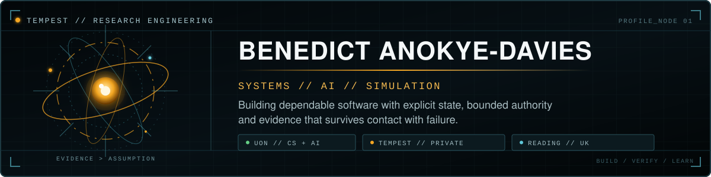

  

  <a href="https://b-davies.dev/">PORTFOLIO</a>&nbsp;&nbsp;|&nbsp;&nbsp;
  <a href="https://www.linkedin.com/in/benedict-anokye-davies/">LINKEDIN</a>&nbsp;&nbsp;|&nbsp;&nbsp;
  <a href="mailto:benedictanokyedavies@gmail.com">EMAIL</a>

## Computer Science student building dependable systems and applied AI

I am a BSc Computer Science with Artificial Intelligence student at the University of Nottingham, graduating in 2028. I build backend services, deterministic simulations and governed agent workflows, and I am seeking backend, systems, fintech and applied-AI internships.

My direction is systems plus AI: strong backend and operating-systems foundations now, then deeper work in simulation, ML systems and robotics. I care about reproducible verification, visible failure modes and explicit control over risky actions.

## Selected public work

### [Arbiter](https://github.com/bbeennyy860-cyber/arbiter) | governed payments prototype

Co-built with Alex Kurkar for the Nous Research x NVIDIA x Stripe hackathon. Arbiter reads invoices, applies deterministic payment policy, routes uncertain decisions through bounded model judgement and human escalation, and settles only through Stripe test mode.

My documented contribution includes backend policy, the agent core, ledger, governed payment execution, reconciliation and verification. It is a prototype, not a real-money payment service.

### [helios-vps-runner](https://github.com/bbeennyy860-cyber/helios-vps-runner) | safety-gated remote operations

A Python CLI for running allowlisted operational scripts on SSH hosts. It scans script content, separates inspection from application and writes structured local receipts for later review.

The scanner is a safety gate, not a sandbox. SSH permissions, secrets and remote account authority remain external controls.

### [AEOLUS](https://github.com/arm-hackathon/arm-hackathon) | team habitat-simulation project

A public team project exploring space-habitat ventilation through deterministic simulation, recovery-policy evaluation and advisory forecasting. My public contributions span simulation and scenario contracts, recovery evidence and model-evaluation tooling.

Deterministic software retains actuator authority while learned forecasts remain advisory. This is simulation and development evidence, not physical spacecraft control or a deployed life-support system. The [AEOLUS companion interface](https://icarus-theta-five.vercel.app/) provides the visual topology workspace.

## Current foundation

- **Languages:** Python, SQL, TypeScript and C. Building C++ and Java foundations.
- **Backend and systems:** FastAPI, PostgreSQL, Linux, SSH, Docker, Git and GitHub Actions
- **Learning now:** algorithms and data structures, operating systems, concurrency, C++ and machine learning from first principles

Based in Reading and Nottingham, UK. Authorised to work in the UK.
